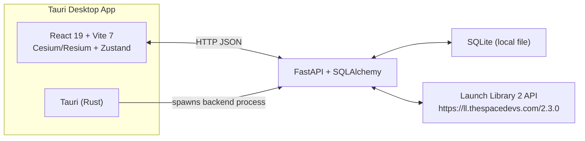
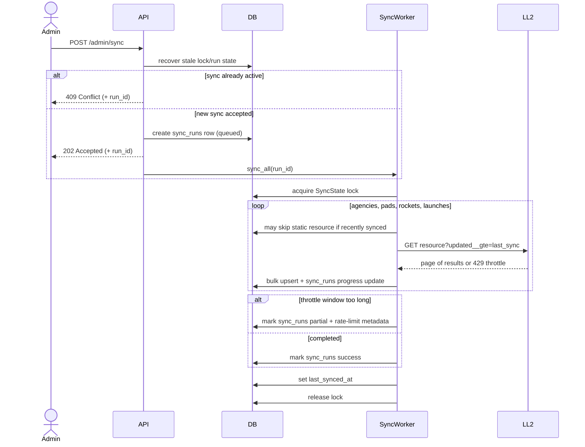
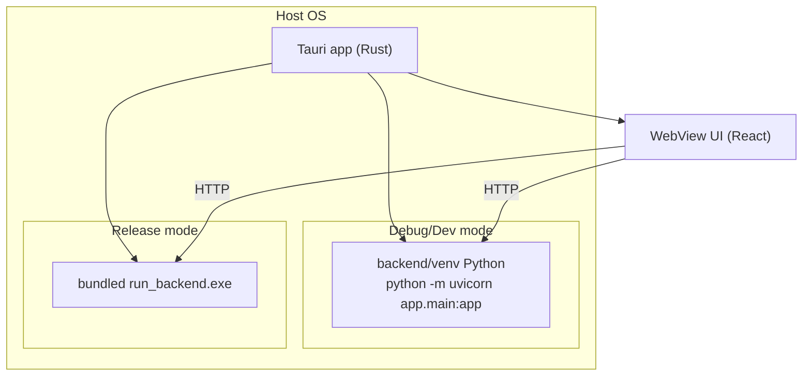

# Development Guide

Architecture, data model, API surface, sync internals, and local setup for working on RocketGlobe's code. Looking to just download and run the app instead? See the [main README](../README.md).

RocketGlobe is a Tauri desktop application that renders global launch activity on a Cesium globe. It ships with a local FastAPI backend that ingests Launch Library 2 (LL2) data and serves a read-only API for the UI.

**Architecture**



**Sync Pipeline**



**Process Model**



## Components

**Frontend**

- React 19 + Vite 7 + TypeScript, Cesium/Resium for the globe, Zustand for state.
- API base URL is `VITE_API_BASE_URL` and defaults to `http://127.0.0.1:8000/api`.
- Initial data bootstrap retries API reads (up to 8 attempts) to tolerate backend startup lag.
- Dev server runs on `http://localhost:1420` in Tauri dev mode.
- Shared cross-component logic (pagination, per-entity launch counts/splits, debounced search, overlay positioning) lives in `src/hooks/`.
- ESLint (`eslint.config.js`) + Prettier + `tsc --noEmit` for static checks; Vitest (`vitest.config.ts`) for unit tests, currently covering store selectors and the shared hooks.

**Backend**

- FastAPI app in `backend/app/main.py`.
- SQLAlchemy ORM with synchronous sessions.
- `init_db()` runs in app lifespan startup.
- LL2 sync implemented in `backend/app/workers/sync_worker.py`.
- Rate limiting and retry logic in `backend/app/services/ll2_client.py`.
- Sync lock state is stored in `sync_state` and run/progress state is stored in `sync_runs`.
- Startup and admin endpoints recover stale lock/run state before accepting new sync work.

**Database**

- SQLite, stored as a single file (`DATABASE_URL=sqlite:///./rocketglobe.db` by default in dev). In packaged release builds it lives under the app's local data directory so each user's synced data persists across app updates.
- Migrations exist under `backend/alembic/versions`. Alembic runs with `render_as_batch=True` on SQLite so future column changes go through the temp-table-rebuild path SQLite requires.
- `seed_if_missing()` (`backend/app/database.py`) runs at backend startup and at the top of `alembic/env.py`: if the `DATABASE_URL` sqlite file doesn't exist yet, it's copied from the committed offline snapshot (`backend/seed_data/rocketglobe_seed.db`) instead of starting from an empty schema. It never touches a database file that already exists, synced or not. This is dev-only — packaged release builds (`release-windows.ps1`) still initialize an empty schema and rely on a live sync.
- `pads.latitude`/`pads.longitude` are plain floats; there is no PostGIS/geospatial extension in use.

## Data Model (Backend)

Tables are defined under `backend/app/models`.

**agencies**

- `ll2_id`, `name`, `abbrev`, `type`, `country_code`, `description`, `founding_year`, `administrator`, `logo_url`, `is_active`

**pads**

- `ll2_id`, `name`, `latitude`, `longitude`, `country_code`, `map_url`, `total_launch_count`, `agency_id`

**rockets**

- `ll2_id`, `name`, `family`, `full_name`, `variant`, `description`, `length`, `diameter`, `leo_capacity`, `gto_capacity`, `launch_mass`, `thrust`, `is_reusable`, `is_active`, `manufacturer_id`

**launches**

- `ll2_id`, `name`, `status`, `net`, `window_start`, `window_end`, `mission_name`, `mission_description`, `mission_type`, `orbit`, `webcast_live`, `video_url`, `pad_id`, `rocket_id`, `agency_id`, `image_url`, `raw_data`

**sync_state**

- `resource`, `last_synced_at`, `is_locked`, `lock_owner`, `locked_at`

**sync_runs**

- `run_id`, `status`, `is_active`, `current_resource`, `progress_done`, `progress_total`, `stats`, `message`, `error`, `started_at`, `finished_at`

All tables include `created_at` and `updated_at` from `TimestampMixin`, except `sync_state`.

## API Surface

All routes are read-only except the admin sync utilities.

**Launches**

- `GET /api/launches/` params: `skip`, `limit`, `status`, `agency_id`, `start_date`, `end_date`
- `GET /api/launches/upcoming/` params: `limit`
- `GET /api/launches/{id}`

**Pads**

- `GET /api/pads/` params: `skip`, `limit`, `country_code`
- `GET /api/pads/{id}`

**Agencies**

- `GET /api/agencies/` params: `skip`, `limit`, `country_code`, `type`
- `GET /api/agencies/{id}`

**Rockets**

- `GET /api/rockets/` params: `skip`, `limit`, `family`, `is_active`
- `GET /api/rockets/{id}`

**Admin**

- `POST /admin/sync` starts a background sync and returns `run_id` (202 if accepted, 409 with active `run_id` if already running, 429 when launches are in cooldown and static resources are already fresh)
- `GET /admin/sync-status` returns counts, lock state, and run status/progress; supports optional `run_id` query param
- `GET /admin/api-throttle` proxies LL2 `/api-throttle/`
- `GET /admin/test-api` fetches 1 agency, pad, rocket, launch
- `GET /admin/check-api` returns LL2 reported launch count
- `DELETE /admin/clear-data?confirm=true`

**Health**

- `GET /health` performs a simple DB query and returns counts

Swagger UI is available at `/docs`.
Use trailing slashes on collection routes to avoid `307 Temporary Redirect` responses.

## Sync and Rate Limiting

The LL2 client enforces minimum spacing between requests, exponential backoff with jitter, and honors `Retry-After` and `X-RateLimit-Reset` headers when available. Sync logic is incremental by resource and uses `updated__gte` where supported.

Current sync behavior:

- A DB-level lock (`sync_state`) prevents concurrent full syncs.
- Progress and lifecycle are tracked per run in `sync_runs` (`queued`, `running`, `success`, `partial`, `failed`, `blocked`).
- Stale locks/runs are recovered on startup and before admin sync actions.
- If LL2 asks for a throttle wait window longer than configured max wait, the request fails fast instead of sleeping for many minutes.
- Static resources (`agencies`, `pads`, `rockets`) are skipped when recently synced to reduce LL2 query volume; `launches` are always attempted.
- If a recent run was launch-rate-limited, launches are temporarily skipped until the prior wait window expires (cooldown), to avoid repeated LL2 hammering.
- `GET /admin/sync-status?lightweight=true` skips heavy DB count queries and is intended for UI polling.

Run status values (`sync_runs.status`):

- `queued`: accepted and waiting for worker thread.
- `running`: actively syncing resources.
- `success`: completed and lock released.
- `partial`: completed with rate-limit skips (`run.stats._rate_limited` contains details).
- `failed`: sync aborted due to non-recoverable exception.
- `blocked`: did not start because another run held the lock.

Useful fields in `GET /admin/sync-status`:

- `run.run_id`: stable id to poll the same run.
- `run.error`: failure reason (for example `LL2 rate limit window too long ...`).
- `run.stats`: per-resource counts; includes `"_skipped"` for resources intentionally skipped.
- `run.stats._rate_limited`: per-resource retry windows in seconds when rate-limited.
- `is_sync_running`: true only for active queued/running runs.
- `retry_after_seconds`: max retry window (seconds) derived from `run.stats._rate_limited`.
- `rate_limited_resources`: flattened map of resource -> retry seconds.
- `POST /admin/sync` may return `retry_after_seconds` directly when a cooldown pre-check blocks the run.

**Seed snapshot (`backend/tools/build_seed_snapshot.py`)**

LL2's anonymous tier is ~15 requests/hour, which a fresh install's first full-history sync can exceed immediately (confirmed with The Space Devs: bulk-crawling once and caching a snapshot is the expected pattern, rather than every install re-crawling full history). This is a separate, deliberately patient tool — not the live per-user sync above — meant to be run by hand, unattended, for as long as a full crawl takes:

```bash
cd backend
python tools/build_seed_snapshot.py --out seed_data/rocketglobe_seed.db
```

- Defaults to production LL2 regardless of `backend/.env` (a seed built from the dev sandbox's small dataset would be useless).
- Sleeps through rate-limit windows instead of failing fast, and checkpoints progress to disk after every page, so it's safe to Ctrl+C and re-run to resume.
- Resulting `.db` file is the historical seed intended to ship with the app (or be loaded once on first run); the live sync then only needs to fetch new/changed data per user.

## Sync Troubleshooting

**Symptom: sync ends quickly with a rate-limit message**

Example error:

`LL2 rate limit window too long (3131.0s) ... max allowed wait is 120s`

What this means:

- LL2 asked the client to wait longer than your configured maximum.
- With partial mode enabled, the run finishes as `partial` and reports retry metadata instead of sleeping for many minutes.

What to do:

1. Check throttle info:

```powershell
curl.exe -s http://127.0.0.1:8000/admin/api-throttle
```

2. Retry sync later, or increase wait budgets if you prefer waiting over skip/fail-fast:
   `LL2_MAX_WAIT_SECONDS`, `LL2_MAX_REQUEST_DURATION`, `LL2_LAUNCHES_MAX_WAIT_SECONDS`, `LL2_LAUNCHES_MAX_REQUEST_DURATION`.

3. Check backend startup logs for the active runtime config line:

`LL2 config: ... retries=... max_wait=... max_duration=...`

If this still shows legacy values (for example retries `40` and max wait `600`), your local backend `.env` has older overrides; update or remove those variables.

**Symptom: `POST /admin/sync` returns 409**

- This indicates a run is already active.
- Use the returned `run_id` and poll that run instead of starting a new one.

Manual poll example (PowerShell):

```powershell
$sync = curl.exe -s -X POST http://127.0.0.1:8000/admin/sync | ConvertFrom-Json
$runId = $sync.run_id
while ($true) {
  $st = curl.exe -s "http://127.0.0.1:8000/admin/sync-status?run_id=$runId" | ConvertFrom-Json
  "$($st.run.status) | $($st.run.current_resource) | $($st.run.progress_done)/$($st.run.progress_total)"
  if (-not $st.is_sync_running) { break }
  Start-Sleep -Seconds 3
}
$st.run | Format-List
```

## Configuration

Environment templates:

- Root frontend template: `.env.example`
- Backend template: `backend/.env.example`

**Backend env vars** (read via `pydantic_settings`, `.env` in the backend working directory):

Environment variables override code defaults. Confirm effective values from backend startup logs (`LL2 config: ...`).

| Variable                               | Default                             | Purpose                                                            |
| -------------------------------------- | ----------------------------------- | ------------------------------------------------------------------ |
| `DATABASE_URL`                         | none                                | SQLAlchemy DB URL                                                  |
| `LL2_BASE_URL`                         | `https://ll.thespacedevs.com/2.3.0` | LL2 API root                                                       |
| `LL2_SYNC_INTERVAL`                    | `900`                               | Defined but not currently scheduled in code                        |
| `LL2_SYNC_PAGE_LIMIT`                  | `500`                               | Page size used for LL2 sync requests                               |
| `LL2_MIN_REQUEST_INTERVAL`             | `2.0`                               | Minimum seconds between LL2 requests                               |
| `LL2_BASE_BACKOFF`                     | `1.0`                               | Base backoff seconds                                               |
| `LL2_MAX_BACKOFF`                      | `60.0`                              | Max backoff seconds                                                |
| `LL2_MAX_RETRIES`                      | `8`                                 | Max retries per non-launch request                                 |
| `LL2_MAX_WAIT_SECONDS`                 | `120`                               | Max allowed throttle wait before fail-fast                         |
| `LL2_MAX_REQUEST_DURATION`             | `300`                               | Max total retry budget (seconds) per request                       |
| `LL2_LAUNCHES_MIN_REQUEST_INTERVAL`    | `2.5`                               | Launches-only minimum request spacing (seconds)                    |
| `LL2_LAUNCHES_MAX_RETRIES`             | `20`                                | Launches-only max retries                                          |
| `LL2_LAUNCHES_MAX_WAIT_SECONDS`        | `300`                               | Launches-only max allowed throttle wait                            |
| `LL2_LAUNCHES_MAX_REQUEST_DURATION`    | `1800`                              | Launches-only max retry budget (seconds)                           |
| `LL2_STATIC_RESOURCES_MIN_INTERVAL`    | `86400`                             | Skip agencies/pads/rockets sync if recently synced                 |
| `LL2_EXISTING_DATA_LOOKBACK_HOURS`     | `24`                                | Fallback incremental baseline window when sync state is missing    |
| `LL2_ALLOW_PARTIAL_SYNC_ON_RATE_LIMIT` | `True`                              | If true, sync completes as partial when LL2 rate-limits a resource |
| `SQL_ECHO`                             | `False`                             | SQLAlchemy SQL echo                                                |
| `API_HOST`                             | `127.0.0.1`                         | Host uvicorn binds to (`run_backend.py` and `python app/main.py`)  |
| `API_PORT`                             | `8000`                              | Port uvicorn binds to (`run_backend.py` and `python app/main.py`)  |

**Frontend env vars**

| Variable            | Default                     | Purpose                |
| ------------------- | --------------------------- | ---------------------- |
| `VITE_API_BASE_URL` | `http://127.0.0.1:8000/api` | Base URL for API calls |

The globe renders without imagery tiles — a flat ground with country outlines
drawn from GeoJSON — so no Cesium Ion token is required and the globe works
with no network.

**Tauri env vars**

| Variable                          | Default | Purpose                                                                                 |
| ---------------------------------- | ------- | ----------------------------------------------------------------------------------------- |
| `ROCKETGLOBE_DISABLE_BACKEND`     | unset   | If truthy, do not spawn backend                                                         |
| `ROCKETGLOBE_FORCE_SPAWN_BACKEND` | unset   | Debug mode only: spawn the embedded uvicorn even if `127.0.0.1:8000` is already in use   |

## Development

**Prerequisites**

- Node.js (Vite 7 requires Node `>=20.19` or `22.12+`)
- Bun
- Rust toolchain (for Tauri)
- Python 3.x (for backend dev/build tooling)

No separate database server is required — the backend uses SQLite, a single local file.

**Database setup**

```bash
cd backend
alembic upgrade head
```

If you prefer SQLAlchemy metadata creation instead of migrations:

```bash
cd backend
python -c "from app.database import init_db; init_db()"
```

**Backend only**

```bash
cd backend
python -m venv venv
venv\Scripts\pip install -r requirements.txt
python -m uvicorn app.main:app --host 127.0.0.1 --port 8000
```

`DATABASE_URL` defaults to `sqlite:///./rocketglobe.db` (relative to `backend/`) if unset.

For long-running sync debugging, prefer running without `--reload`.

**Frontend only**

```bash
bun install
bun run dev
bun run check    # tsc --noEmit
bun run lint     # eslint
bun run format   # prettier --write
bun run test     # vitest run
```

**Tauri dev**

```bash
# ensure backend/venv exists (Tauri debug mode uses this interpreter)
cd backend
python -m venv venv
venv\Scripts\pip install -r requirements.txt

# from repo root
cd ..
bun run tauri dev
```

**CI** (`.github/workflows/ci.yml`)

Three jobs run on every push/PR to `main`/`develop`:

- `frontend` (Windows runner): `bun install`, `bun run check`, `bun run format:check`. The Tauri build itself is currently skipped in CI.
- `backend` (Ubuntu runner): `ruff check .`, `ruff format --check .`, `alembic upgrade head`, `pytest tests/`.
- `lint` (Ubuntu runner): checks that the latest commit message starts with a Conventional Commits type (`feat|fix|docs|style|refactor|test|chore|perf|ci|build|revert:`); non-blocking.

`bun run lint` and `bun run test` are not run in CI — run them locally before considering frontend work done.

## Packaging Notes

Current Tauri bundle resources are configured in `src-tauri/tauri.conf.json`:

- `src-tauri/resources/backend/run_backend.exe`

Important behavior:

- Debug build: Tauri starts backend via `backend/venv` Python + `uvicorn`. `DATABASE_URL` comes from `backend/.env`, defaulting to `sqlite:///./rocketglobe.db`.
- Release build: Tauri starts bundled `run_backend.exe` with `DATABASE_URL` pointed at `<app_local_data_dir>/rocketglobe.db` (see `resolve_release_database_url` in `src-tauri/src/lib.rs`), so each user's synced data lives in a single file that persists across app updates.
- `src-tauri/resources/` is gitignored in this repo, so those artifacts must exist locally before `tauri build`.

## Windows Release

This path keeps the current architecture: Tauri desktop app + local backend process.

1. Ensure required resource files exist:

- `src-tauri/resources/backend/run_backend.exe`

2. Run the release pipeline:

```powershell
bun run release:windows
```

Alternative local-default pipeline:

```powershell
bun run release:windows:local
```

What `scripts/release-windows.ps1` does:

- writes `backend/.env` and root `.env`
- creates `backend/venv` if missing
- installs backend dependencies
- initializes schema via `init_db()`
- installs frontend dependencies with `bun install --frozen-lockfile`
- runs frontend type-check (`bun run check`) unless skipped
- runs `bun run tauri build`

Output artifacts are placed under:

- `src-tauri/target/release/bundle`

### Runtime Requirements On Target Machines

- System Python is not required for release mode when using bundled `run_backend.exe`.
- No database server is required on the target machine — SQLite is a single file managed entirely by the app.

## Project Context

This project was built as an exploratory learning project and evolved over roughly 4 months. It was not originally scoped as a production-grade architecture exercise, so some decisions favor iteration speed over clean system boundaries.

For full context: most Rust work was heavily assisted (vibe-coded), and much of the frontend optimization was done with Codex and older Claude models depending on what free tooling was available. The backend originally used PostgreSQL + PostGIS; it was migrated to SQLite since the app is a single-user local mirror of LL2 data and never used PostGIS's spatial query functions (pad coordinates are plain lat/lon floats).

## Known Limitations

- Backend process management is coupled to Tauri startup and can be fragile across environments.
- LL2 throttling behavior can still limit how fresh launches data can be in a given sync window, especially on the very first full sync.
- Release resources (`run_backend.exe`) are expected to exist locally and are not produced by a single unified pipeline in this repo.
- Architectural boundaries between desktop runtime, backend runtime, and data layer are functional but not yet minimal.
